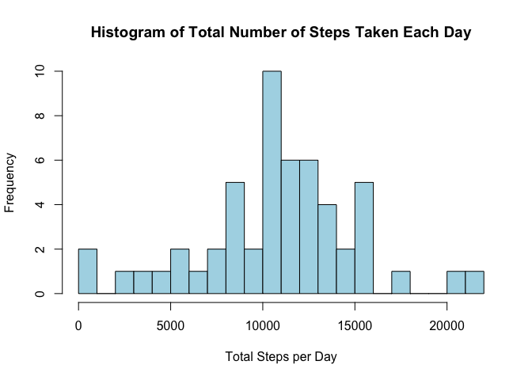
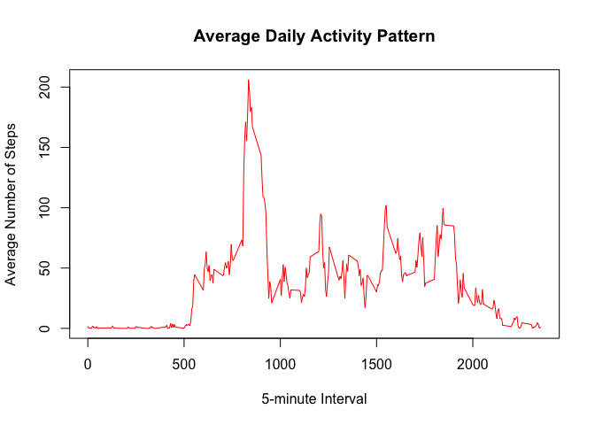
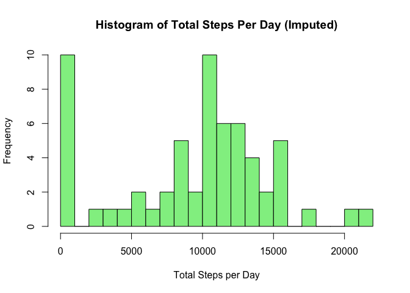
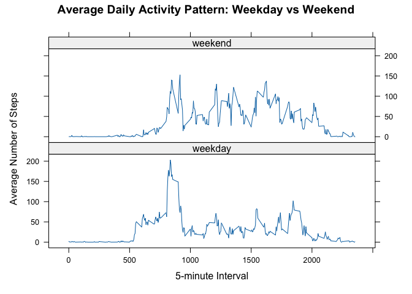

## Loading and preprocessing the data

1. Unzip file
2. Load the csv in a data frame
3. Omit NAs


``` r
unzip("activity.zip")
data <- read.csv("activity.csv")
data_no_na <- na.omit(data)
```

## What is mean total number of steps taken per day?

1. Calculate total number of steps per day
2. Plot histogram
3. Calculate and print mean and median


``` r
# Calculate total number of steps per day
total_steps_per_day <- aggregate(steps ~ date, data = data_no_na, sum)

# Plot histogram
hist(
  total_steps_per_day$steps,
  breaks = 20,
  main = "Histogram of Total Number of Steps Taken Each Day",
  xlab = "Total Steps per Day",
  col = "lightblue",
  border = "black"
)
```

<!-- -->

``` r
# Calculate and print mean and median
mean_steps <- mean(total_steps_per_day$steps)
median_steps <- median(total_steps_per_day$steps)

cat("Mean total steps per day:", mean_steps, "\n")
```

```
## Mean total steps per day: 10766.19
```

``` r
cat("Median total steps per day:", median_steps, "\n")
```

```
## Median total steps per day: 10765
```

## What is the average daily activity pattern?

1. Calculate average steps per interval
2. Time series plot
3. Find interval with max average steps


``` r
# Calculate average steps per interval
avg_steps_per_interval <- aggregate(steps ~ interval, data = data_no_na, mean)

# Time series plot
plot(avg_steps_per_interval$interval, avg_steps_per_interval$steps,
     type = "l", col = "red",
     main = "Average Daily Activity Pattern",
     xlab = "5-minute Interval",
     ylab = "Average Number of Steps")
```

<!-- -->

``` r
# Find interval with max average steps
max_interval <- avg_steps_per_interval[which.max(avg_steps_per_interval$steps), ]
cat("Interval with max average steps:", max_interval$interval, "\n")
```

```
## Interval with max average steps: 835
```

``` r
cat("Maximum average steps:", max_interval$steps, "\n")
```

```
## Maximum average steps: 206.1698
```

## Imputing missing values

1. Count total NAs
2. Strategy: fill NAs with the mean for that 5-minute interval. This method preserves the typical activity pattern throughout the day.
3. Merge to get mean steps for each interval
4. Calculate total steps per day
5. Plot histogram
6. Calculate and print mean and median


``` r
# Count total NAs
total_na <- sum(is.na(data$steps))
cat("Total missing values:", total_na, "\n")
```

```
## Total missing values: 2304
```

``` r
# Strategy: fill NAs with the mean for that 5-minute interval
interval_means <- aggregate(steps ~ interval, data = data, FUN = mean, na.rm = TRUE)

# Merge to get mean steps for each interval
data_imputed <- merge(data, interval_means, by = "interval", suffixes = c("", "_mean"))
data_imputed$steps[is.na(data_imputed$steps)] <- data_imputed$steps_mean
```

```
## Warning in data_imputed$steps[is.na(data_imputed$steps)] <-
## data_imputed$steps_mean: number of items to replace is not a multiple of
## replacement length
```

``` r
data_imputed$steps_mean <- NULL  # Drop helper column

# Calculate total steps per day
total_steps_per_day_imp <- aggregate(steps ~ date, data = data_imputed, sum)

# Plot histogram
hist(total_steps_per_day_imp$steps, breaks = 20,
     main = "Histogram of Total Steps Per Day (Imputed)",
     xlab = "Total Steps per Day", col = "lightgreen", border = "black")
```

<!-- -->

``` r
# Calculate and print mean and median
mean_steps_imp <- mean(total_steps_per_day_imp$steps)
median_steps_imp <- median(total_steps_per_day_imp$steps)

cat("Mean (imputed):", mean_steps_imp, "\n")
```

```
## Mean (imputed): 9371.437
```

``` r
cat("Median (imputed):", median_steps_imp, "\n")
```

```
## Median (imputed): 10395
```

The mean and median differ from the original estimate. While the imputed median is relatively close to the original value, the imputed mean differs significantly.

## Are there differences in activity patterns between weekdays and weekends?

1. Convert date and create weekday/weekend factor
2. Calculate average steps per interval by day type
3. Panel plot


``` r
# Convert date and create weekday/weekend factor
data_imputed$date <- as.Date(data_imputed$date)
data_imputed$day_type <- ifelse(weekdays(data_imputed$date) %in% c("Saturday", "Sunday"),
                                "weekend", "weekday")
data_imputed$day_type <- as.factor(data_imputed$day_type)

# Calculate average steps per interval by day type
library(dplyr)
```

```
## 
## Attaching package: 'dplyr'
```

```
## The following objects are masked from 'package:stats':
## 
##     filter, lag
```

```
## The following objects are masked from 'package:base':
## 
##     intersect, setdiff, setequal, union
```

``` r
avg_steps <- data_imputed %>%
  group_by(interval, day_type) %>%
  summarise(steps = mean(steps), .groups = 'drop')

# Panel plot
library(lattice)
xyplot(steps ~ interval | day_type, data = avg_steps,
       type = "l",
       layout = c(1, 2),
       xlab = "5-minute Interval",
       ylab = "Average Number of Steps",
       main = "Average Daily Activity Pattern: Weekday vs Weekend")
```

<!-- -->
